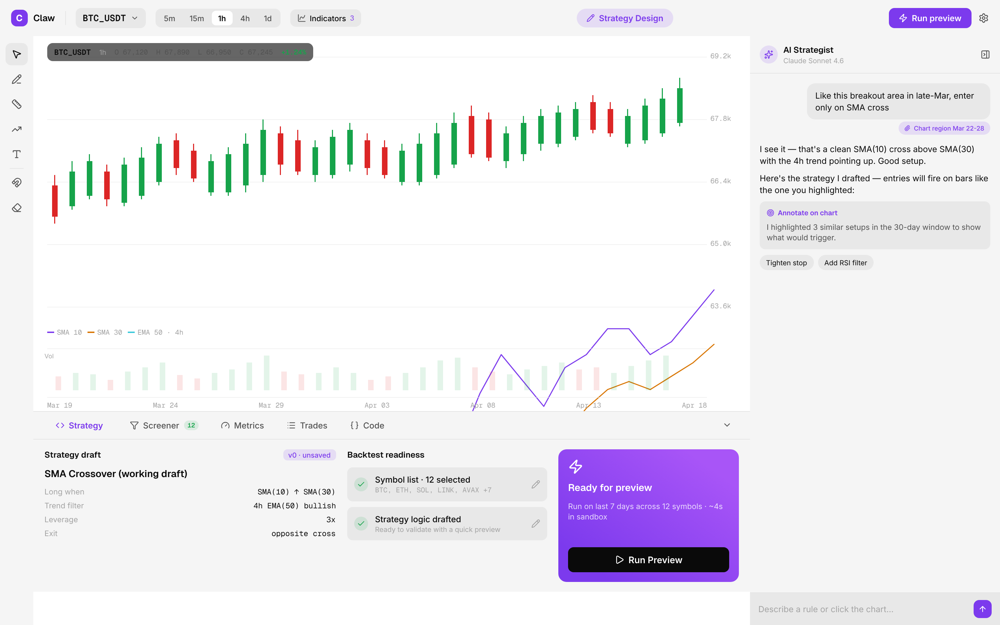
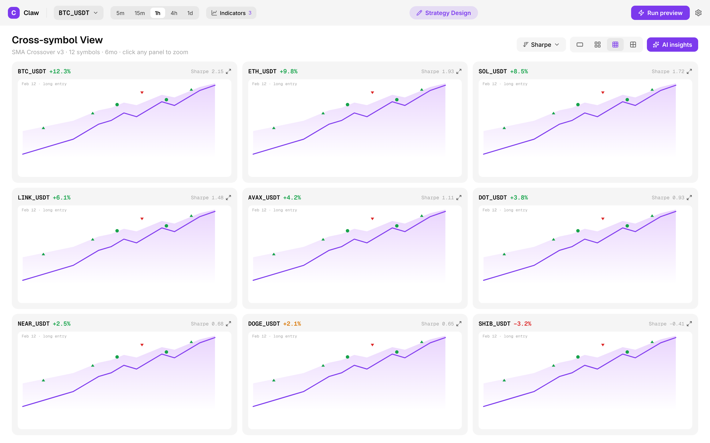
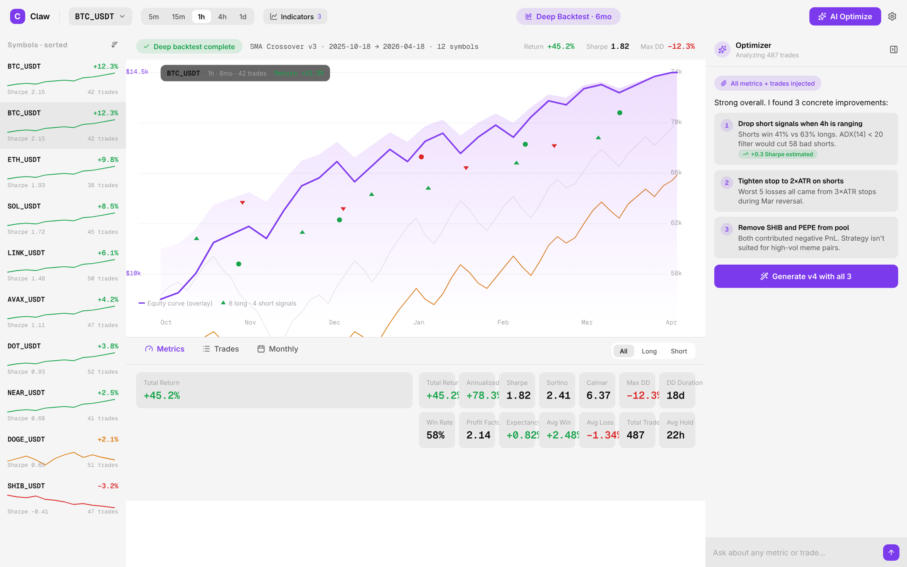

# claw-trader

**English** · [简体中文](README.zh-CN.md) · [繁體中文](README.zh-TW.md)

[](LICENSE)

> **AI-assisted quant research for everyday users.** Describe a strategy in plain English, let AI turn it into code, and see how it would have played out on real historical markets — all on your own machine.

<p align="center">
  
</p>

<p align="center">
  <em>Talk to the AI on the right. It writes the strategy. You hit Run and see whether it worked.</em>
</p>

---

## How it works

```
  1. Describe your idea           2. AI drafts the strategy       3. Backtest it
  ───────────────────────         ───────────────────────         ───────────────────────
  "Buy BTC when RSI on            Python code appears             Run against years of
   the 1h chart drops below        in the editor. Edit it if      real historical data.
   30 and close on the first       you want. Hit Run.             See the return, Sharpe,
   red candle."                                                    drawdown, and every
                                                                    trade the strategy made.
```

Iterate until the numbers look like something you'd stake real money on. **Live order execution is on the roadmap; today the platform is backtest-only.**

## You don't need to code

> **Don't code? That's fine.** Tell the AI what you want in plain English — *"buy when RSI crosses above 30, close on the next red candle"* — and it produces a runnable strategy for you. Look at the Python if you're curious, but you don't have to.

## What you can do

- **Talk to AI, get a strategy.** Describe the idea in natural language. The AI strategist writes the code. Tweak the prompt, re-run, iterate.
- **See how it would have played out.** Run the strategy against years of real historical market data. Metrics, trade journal, equity curve, drawdown — all in one place.
- **Compare ideas across many markets at once.** Write a filter ("volume over $100M, trend up, RSI below 70"), see the matches ranked, drill into any of them.
- **Keep everything on your machine.** No cloud accounts, no uploaded data, no telemetry. Your API keys and results never leave your laptop.

*Already fluent in Python?* You can edit the AI's output or write strategies from scratch — the `Strategy` class is plain Python with `on_bar`, `buy`, `sell`, `close` methods.

## What it isn't

- **Not a trading bot — yet.** Live order execution is planned (see below) but not yet implemented. Today the platform reads historical market data and simulates strategies only.
- **Not a paper-trading service.** No forward testing against live market feeds yet.
- **Not a managed service.** Nothing runs in our cloud. There is no signup, no account, no server we control. You run it locally.
- **Not financial advice.** A strategy that performs well on historical data can still lose money in live markets.

**What's on the way:** live order execution against supported exchanges, paper trading on live feeds, and more data connectors. Roadmap, not promises — see `openspec/` for active proposals.

## Quick start

You need **Docker** and **Docker Compose**. That's it.

**1. Start the data + database services:**

```bash
cd data-aggregator
docker compose -f docker-compose.yml -f docker-compose.test.yml up -d --build
```

First run pulls a small slice of historical K-lines so you have something to backtest immediately.

**2. Start the API service + sandbox:**

Uses the same TimescaleDB as step 1 (shared Docker networks `claw-net` / `claw-sandbox-net`). If you only start `service-api`, run `make db-up` from the repo root first so the database is up.  The compose file here builds BOTH `service-api` (Go, API + orchestration) AND `sandbox-service` (Python, where user strategies actually run).

```bash
cd ../service-api
docker compose up -d --build
```

**3. Open the desktop app:**

```bash
cd ../desktop-client
pnpm install
pnpm dev
```

The app opens against your local services. On first launch it asks for an AI API key — paste one from OpenAI, Anthropic, DeepSeek, Gemini, or Moonshot. Then start asking the AI for strategy ideas.

<p align="center">
  
</p>

<p align="center">
  <em>Screen many markets at once. Find the ones worth a closer look.</em>
</p>

## Architecture

*For developers who want to poke around. Regular users can skip this.*

```
  ┌───────────────────────────────┐
  │  desktop-client (Electron +   │
  │  React + TypeScript)          │
  └───────────┬───────────────────┘
              │ HTTP 8081
              ▼
              ┌─────────────────────────┐
              │ service-api         │
              │ (Go + Hertz)            │
              │  • /api/backtest/*      │
              │  • /api/screener/*      │
              │  • /api/klines /symbols │
              │    /gaps (data gateway) │
              │  • spawns Python sandbox│
              └───────┬─────────────────┘
                      │ SQL (read)
                      ▼
              ┌──────────────┐
              │ TimescaleDB  │ ◄── SQL (write)
              │ (OHLCV)      │      │
              └──────────────┘      │
                                    │
              ┌─────────────────────┴───┐
              │ data-aggregator         │
              │ (Go, headless worker)   │
              │  • boot → refresh tops  │
              │  • detect gaps          │
              │  • S3 + API backfill    │
              │  • NO external HTTP API │
              └─────────────────────────┘
                      ▲
                      │ S3 CSV + REST
                      │
                 Gate.io public data

  ┌─ AI (your API key) ───────────────────┐
  │  OpenAI / Anthropic / DeepSeek /      │
  │  Gemini / Moonshot — called from      │
  │  the desktop client only              │
  └───────────────────────────────────────┘
```

Three services, one database, one sandbox per backtest run. `data-aggregator` is a **headless worker**: on startup it checks data completeness and backfills what's missing; the frontend never talks to it directly. `service-api` is the single entry point the desktop client hits, serving both backtest orchestration and read-only market-data endpoints. The sandbox gets a read-only DB user — user-submitted Python can query historical candles but can't write or delete anything.

The repo uses [OpenSpec](openspec/) for proposal-driven development — every notable change has a proposal, a design doc, and a spec under `openspec/`.

<p align="center">
  
</p>

<p align="center">
  <em>Deep analysis for one symbol — equity curve, metrics, and a full trade journal side by side.</em>
</p>

## Data sources & AI providers

**Market data** currently comes from Gate.io's public historical dataset (hosted on S3) and its REST API. Both are open — no API key required. The `data-aggregator` handles download, storage, and gap detection. Other venues are on the roadmap; the engine itself is venue-agnostic and operates on a generic `Bar(open, high, low, close, volume)` abstraction.

**AI providers** — any OpenAI-compatible endpoint works. Tested with:

- OpenAI (`gpt-4o`, `gpt-4o-mini`)
- Anthropic (`claude-*`)
- DeepSeek (`deepseek-chat`, `deepseek-reasoner`)
- Google Gemini (`gemini-*`)
- Moonshot (`kimi-*`)

Bring your own API key. It stays on your machine.

## Privacy

- **Your API keys stay on your machine.** Stored locally, sent only to the provider you chose.
- **No telemetry.** No analytics SDK, no crash reporter, no phone-home. If the app hits the internet, it's a data source or AI provider you configured.
- **No account, no cloud sync.** Backtests, strategies, and screeners live in the local database you spun up. Delete the Docker volume, and it's all gone.

## Tech stack

- **Languages**: Go (services), Python 3.11 (strategies), TypeScript + React (client)
- **Storage**: [TimescaleDB](https://www.timescale.com/) (Postgres + time-series)
- **Charting**: [TradingView Lightweight Charts](https://www.tradingview.com/lightweight-charts/)
- **Indicators**: pure numpy / pandas (`claw.indicators`) — keeps the sandbox image small

## Project layout

```
claw-trader/
├── data-aggregator/   Go service · pulls & stores historical K-lines
├── service-api/       Go service · HTTP API + AI/AST gates + orchestration
├── sandbox-service/   Python service · long-lived prefork pool · runs user code
├── desktop-client/    Electron + React · the UI
├── api/               OpenAPI contract (shared across services)
├── docs/              Project docs + design (.pen) mockups + screenshots
├── scripts/           Helper scripts (pre-commit, e2e, golden-file refresh)
├── openspec/          Proposals, designs, specs — the how and why
└── LICENSE            MIT
```

## Contributing

PRs welcome. For anything non-trivial please open an issue (or a proposal under `openspec/`) first. Typos, docs, obvious bugs — just send the PR.

## Status

**Early alpha.** The three services work end-to-end and the desktop client renders the full AI-to-backtest flow, but APIs and schemas may change. Pin to a tag if stability matters.

## Disclaimer

This project is a research and educational tool. It does not execute real trades. Nothing here is financial, investment, legal, or tax advice. Historical backtest results do not predict future returns, and a strategy that looks profitable in a backtest can lose money in live markets for reasons the backtest cannot model — slippage, liquidity, regime change, data quality, and user behaviour. You are solely responsible for complying with the laws and regulations of your jurisdiction when using any data source or integrating with any third-party service referenced by this software.

## License

Released under the [MIT License](LICENSE). Copyright (c) 2026 janespace.
